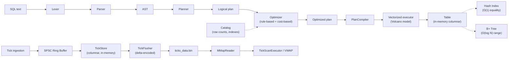

# Tachyon - Time Series Query Engine

An in-memory, high-performance C++ SQL query and time-series engine built from scratch — featuring a hand-written SQL compiler, rule- and cost-based query optimizer, vectorized columnar executor, and **B+ Tree / Hash indexing**.

Tachyon demonstrates zero-dependency database internals engineering: from raw SQL string tokenization to cache-friendly vectorized chunk execution and $O(\log N)$ temporal range scans over financial tick streams.

No external SQL/parsing libraries, no bundled storage engine — every stage of the pipeline is hand-written.

## Architecture

Tachyon is really two engines sharing a lexer/parser front end: a general-purpose SQL pipeline over in-memory columnar tables, and a separate time-series pipeline over a memory-mapped tick file.



| Stage | Directory | Responsibility |
|---|---|---|
| Lexer | `src/lexer` | Tokenizes raw SQL text into a token stream |
| Parser | `src/parser` | Recursive-descent parser → builds the AST |
| AST | `src/ast` | Statement/Expression node definitions (`SelectStatement`, `BinaryExpression`, `FunctionCall`, ...) |
| Planner | `src/planner` | Converts the AST into a tree of relational algebra operators (the logical plan) |
| Optimizer | `src/optimizer` | Rule-based + cost-based rewrites of the logical plan (index selection, join selection, BETWEEN pushdown) |
| Catalog | `src/catalog` | Row counts and index metadata used by the optimizer |
| PlanCompiler | `src/executor/PlanCompiler.*` | Translates an optimized plan into a runnable executor tree, resolving table names against a table registry |
| Executor | `src/executor` | Walks the plan and executes it using the Volcano/iterator model over columnar `Chunk`s |
| Storage | `src/storage` | In-memory columnar `Table`, hash `Index`, and the separate tick/time-series storage (`TickStore`, `TickFlusher`, `MMapReader`, ring buffer) |
| Index | `src/index` | The B+Tree implementation backing range-scan indexes |
| CLI | `src/cli` | Entry point plus the standalone benchmark runners |

### Supported queries

```sql
SELECT name FROM users WHERE id = 42;
```

```sql
SELECT price FROM ticks WHERE time BETWEEN 1704067200500000000 AND 1704067200510000000;
```

```sql
SELECT col1, col2, SUM(col3)
FROM table_a
JOIN table_b ON table_a.id = table_b.a_id
WHERE col1 = 42
GROUP BY col1, col2;
```

- `SELECT` with column projection and aggregate functions (`SUM`, `COUNT`, ...)
- `FROM` with a single base table
- `JOIN ... ON <predicate>` (nested-loop or hash join, chosen by the cost-based optimizer)
- `WHERE` with comparison operators (`=`, `!=`, `<`, `>`, `<=`, `>=`) and `BETWEEN ... AND ...`
- `GROUP BY` with multiple grouping columns
- `EXPLAIN <query>` — prints the logical plan before and after optimization, then runs it

### Execution model

Data is stored **columnar** (`Table::column_data_`, one vector per column) and executed **vectorized** — operators pull `Chunk`s (batches of rows, column-major) from their children rather than one row at a time, following the Volcano/iterator (`init()` / `next()`) execution model used by most real query engines.

`EXPLAIN` isn't a dead end: `PlanCompiler` turns whatever the optimizer decided into an actual `Executor` tree, so the same run that prints the before/after plan also prints real result rows — there's no separate "toy" path that only prints plans and a "real" path that only benchmarks hand-wired executors.

## Build & run

Requires CMake 3.14+ and a C++17 compiler.

```bash
# From the project root
mkdir build
cd build
cmake ..
cmake --build .

# Run
./quilldb               # Linux / macOS
.\quilldb.exe            # Windows
```

`main.cpp` runs a fixed demo query (`EXPLAIN SELECT name FROM users WHERE id = 42;`) against a 100-row in-memory table: it prints the plan before optimization, the plan after the optimizer rewrites `Filter + SeqScan` into `IndexScan`, and then the actual matching row.

## Benchmarks

All numbers below were captured on this machine (Apple M5, macOS, `clang++ -O2`, C++17) by building and running the checked-in benchmark targets directly — nothing here is estimated.

**Hash index vs. sequential scan** — `quilldb_benchmark` runs `SELECT name FROM users WHERE id = <val>;` against a 1,000,000-row table, once as a forced `Filter -> SeqScan` and once via the optimizer-selected `IndexScan` (`src/storage/Index.h`, a single `unordered_map` lookup):

| Plan | Time (1M rows) |
|---|---|
| `Filter -> SeqScan` | ~54–56 ms |
| `IndexScan` | <1 ms |

**B+ Tree range scan vs. linear scan** — `quilldb_btree_test` builds a B+Tree over 5,000,000 sequential keys and runs `BETWEEN` against both the tree (`BTree::searchRange`, an $O(\log N)$ descent + horizontal leaf traversal) and a linear pass over the same data:

| Scan | Time (5M keys, 51-row range) |
|---|---|
| Linear scan | ~4.95 ms |
| B+Tree range scan | ~11 µs (~450x faster) |

**Tick ingestion** — `quilldb_ts_benchmark` pushes 10,485,760 ticks through the SPSC ring buffer into `TickStore`:

| Metric | Value |
|---|---|
| Throughput | ~12.2M ticks/sec |
| p50 latency | ~43 µs |
| p99 latency | ~90 µs |

**Persistence** — `quilldb_flush_benchmark` delta-encodes and flushes 10,000,000 ticks to `ticks_data.bin` (`TickFlusher`):

| Metric | Value |
|---|---|
| Flush time | ~351 ms |
| Write bandwidth | ~516 MB/sec |
| Raw size (32 bytes/tick) | ~305 MB |
| Delta-encoded size | ~181 MB (~41% smaller) |

**Time-series query + VWAP** — `quilldb_query_benchmark` runs a `BETWEEN` query through `TickScanExecutor` against the flushed 10M-tick file (a memory-mapped, delta-decoded forward scan — not the B+Tree above, since this path reads from `ticks_data.bin` rather than a `Table`); `quilldb_vwap_benchmark` aggregates VWAP/OHLCV buckets over a 30-minute window:

| Query | Time |
|---|---|
| `TickScan` (479 matching rows out of 10M) | ~3 ms |
| VWAP/OHLCV aggregation (~10M ticks, 3 buckets) | ~438 ms |

To reproduce: `cmake --build . --target <name>` for any of `quilldb_benchmark`, `quilldb_btree_test`, `quilldb_ts_benchmark`, `quilldb_flush_benchmark`, `quilldb_query_benchmark`, `quilldb_vwap_benchmark` (the last two need `quilldb_flush_benchmark` to have generated `ticks_data.bin` in the working directory first).

## Project structure

```
tachyon/
├── CMakeLists.txt
├── src/
│   ├── lexer/          # Lexer.h / Lexer.cpp / TokenType.h
│   ├── parser/          # Parser.h / Parser.cpp
│   ├── ast/             # AST.h — Statement & Expression node definitions
│   ├── planner/          # Planner.h / Planner.cpp, LogicalPlan.h — operator tree
│   ├── optimizer/        # Optimizer.h / Optimizer.cpp — predicate pushdown, index selection, cost-based join choice
│   ├── catalog/          # Catalog.h / Catalog.cpp — row counts + index metadata
│   ├── index/            # BTree.h / BTree.cpp — B+Tree used by range-indexed columns
│   ├── executor/
│   │   ├── Executor.h/.cpp          # Scan/Filter/Project/Join/Aggregate/IndexScan executors
│   │   ├── PlanCompiler.h/.cpp      # Optimized plan -> runnable executor tree
│   │   ├── IndexRangeScanExecutor.h # B+Tree-backed range scan over a Table
│   │   └── TickScanExecutor.h       # Memory-mapped scan over a flushed tick file
│   ├── storage/
│   │   ├── Storage.h, Index.h       # Columnar Table / Chunk / hash Index
│   │   └── Tick.h, TickStore.h, TickFlusher.h, MMapReader.h, RingBuffer.h
│   │                                 # Separate time-series storage: ingestion ring
│   │                                 # buffer, columnar tick store, delta-encoded
│   │                                 # persistence, and mmap-based reads
│   └── cli/             # main.cpp + standalone benchmark runners
└── build/                # CMake build output (generated, not tracked)
```
